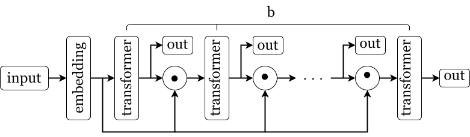

Тестовое задание на LLM Foundations.

## Содержание
- [Содержание](#содержание)
- [Описание сеттинга и проблематики](#описание-сеттинга-и-проблематики)
- [Эксперимент №1: влияние скейлинга модели на результат и экстраполяцию.](#эксперимент-1-влияние-скейлинга-модели-на-результат-и-экстраполяцию)
- [Эксперимент №2: изменение глубины vs изменение итераций.](#эксперимент-2-изменение-глубины-vs-изменение-итераций)
- [Эксперимент №3: оценка влияния Positional Encoding и каузальной маски.](#эксперимент-3-оценка-влияния-positional-encoding-и-каузальной-маски)
- [Эксперимент №4: изменение формата входной матрицы.](#эксперимент-4-изменение-формата-входной-матрицы)
- [Эксперимент №5: анализ SSM версий и их сравнение с трансформерами.](#эксперимент-5-анализ-ssm-версий-и-их-сравнение-с-трансформерами)
- [Эксперимент №7: сравнение различных моделей на прочих классах функций.](#эксперимент-7-сравнение-различных-моделей-на-прочих-классах-функций)
- [Эксперимент №8: сравнение различных вариантов формирования инпута.](#эксперимент-8-сравнение-различных-вариантов-формирования-инпута)

## Описание сеттинга и проблематики

Пусть мы рассматриваем некоторый класс параметризованных функций, который мы обозначим $\mathcal{F}$. Нам дана коллекция пар вида $(\mathbf{x}, f_i(\mathbf{x}))$, где, положим, $f_i \in \mathcal{F} : \mathbb{R}^n \to \mathbb{R}^m$ и $i = \overline{1, K}$.

Разобьём наш набор данных следующим образом:

```math
D = \text{число различных функций } K \times \text{число различных примеров } N_i
```

И представим его как набор из $K$ строк:
```math
D = \begin{cases} \mathbf{x}_{1,1} & f(\mathbf{x}_{1,2}) & ... & \mathbf{x}_{1,N_1+1} & f(\mathbf{x}_{1,N_1+1}) \\ ... & ... & ... & ... & ... \\ \mathbf{x}_{K,1} & f(\mathbf{x}_{K,2}) & ... & \mathbf{x}_{K,N_K+1} & f(\mathbf{x}_{K,N_K+1}) \end{cases}
```

Для удобства положим, что $N_1 = N_2 = ... = N_K$.

Нашей задачей является обучение модели, которая способна на основе примеров некоторой функции $f$ предсказывать её значение при заданном $\mathbf{x}$. Если классические нейросетевые модели представляют собой универсальные аппроксиматоры функций, то в данном случае мы хотим построить аппроксимацию более общего характера.

Мы используем модель на основе архитектуры трансформер, а в качестве способа решения задачи рассматриваем in-context learning. Авторы [статьи](https://arxiv.org/abs/2311.12424) используют следующий способ формирования входной матрицы: (при $m < n$):

```math
\begin{bmatrix} \mathbf{x}_1 \\ f(\mathbf{x}_1) \\ \mathbf{x}_2 \\ f(\mathbf{x}_2) \\ ... \\ \mathbf{x}_{N+1} \end{bmatrix} = \begin{bmatrix} x_{1,1} & x_{1,2} & ... & x_{1,m} & x_{1,m+1} & ... & x_{1,n} \\ f_{1,1} & f_{1,2} & ... & f_{1,m} & 0 & ... & 0 \\ x_{2,1} & x_{2,2} & ... & x_{2,m} & x_{2,m+1} & ... & x_{2,n} \\ f_{2,1} & f_{2,2} & ... & f_{2,m} & 0 & ... & 0 \\ ... & ... & ... & ... & ... & ... & ... \\ x_{N+1,1} & x_{N+1,2} & ... & x_{N+1,m} & x_{N+1,m+1} & ... & x_{N+1,n} \end{bmatrix},
```

и на основании этого входа модель должна предсказать вектор

```math
f(\mathbf{x}_{N+1}) = \begin{bmatrix}
f_{N+1,1} & f_{N+1,2} & ... & f_{N+1,m} \end{bmatrix}
```

Говорим, что в данном случае модель получает $N$ in-context примеров и $1$ запрос.

Я использую такой способ представления практически во всех экспериментах, кроме восьмого, где рассматриваются различные способы формировать инпут.

Каждую строку такой матрицы мы называем токеном. Обучать трансформер я буду как в задаче Next Token Prediction, заставляя его предсказывать смещённую на один токен входную матрицу, в которой последним токеном является $f(\mathbf{x}_{N+1})$.

Мы дорабатываем классический метод использования трансформера следующим образом: вместо того, чтобы один раз пропустить данные через модель, мы совершаем $b$ итераций следующим образом:



Слой `embedding` преобразует матрицу размером $[N+1, n]$ в матрицу размером $[N+1, d]$. На каждой итерации `transformer` используется один и тот же, т.е. с одинаковыми весами. Все `out` записываются в массив и возвращаются как список из $b$ элементов.

Вместо того, чтобы каждую итерацию просто подавать на вход трансформеру выход из предыдущей итерации, я, вслед за авторами статьи, применяю операцию ⊙. Эта техника называется Input Injection, а сама операция, в сущности, может быть произвольной - это может быть сложение, или применение какого-то нелинейного преобразования (в т.ч. конкатенация или нечто подобное), или использование какого-то промежуточного обучаемого слоя. В моих экспериментах я ограничиваюсь сложением, однако в репозитории авторов статьи имеется также возможность использования покомпонентного умножения.

Я использую следующую функцию потерь:

```math
\frac{1}{nb} \sum_{j=1}^{b} \frac{1}{N+1} \sum_{i=1}^{N+1}(f_j(\mathbf{x}_i) - \text{out}_{j,i})^2,
```
где $f_j$ - это просто $j$-я копия $f(\mathbf{x}_i)$. Таким образом, каждый выход `out` сравнивается с таргет вектором, тем самым модель, предположительно, стремится минимизировать ошибку уже на первых итерациях.

Я обнаружил, что значение функции потерь на первых шагах обучения пропорционально числу измерений $n$, поэтому добавляю коэффициент $n^{-1}$. Кроме того, авторы статьи используют такой трюк, как scheduling - они считают функцию потерь не по всем $b$ итерациям, а только по некоторым последним $T$ итерациям. Для моих экспериментов использование scheduling незначительно влияет на потребление памяти, поэтому я решил использовать все доступные выходы модели. Гораздо сильнее на потребление памяти влияет то, что при увеличении $b$ мы кратно увеличиваем память, необходимую для хранения промежуточных состояний алгоритма autograd.

Валидация происходит перед обучением, а затем на каждых 20% обучения, таким образом получается всего шесть раз. Мы усредняем результат по 10 батчам, однако в качестве таргета берём не все токены из каждого выхода, а только последний токен, соответствующий $f(\mathbf{x}_{N+1})$. Т.е. валидация оценивает качество предсказания исключительно следующего токена, тогда как тренировочный лосс сравнивает все токены. Так же, как и в процессе обучения, мы берём выходы каждой итерации $b$, и итоговое значение метрики делим на размерность координатного вектора:

```math
\frac{1}{nb} \sum_{j=1}^{b} \frac{1}{N+1} (f_j(\mathbf{x}_{N+1}) - \text{out}_{j,N+1})^2,
```

Под **обобщающей способностью** мы понимаем способность модели хорошо работать на Out-of-Distribution данных. 

Под **экстраполяцией** модели (способностью к экстраполяции) мы понимаем способность работать с $b$ большим, чем был использован при обучении. Т.к. модель должна аппроксимировать не просто функцию, а целый сходящийся алгоритм, экстраполяция означает также и то, насколько модель хорошо выучила этот алгоритм.

Под **натуральной экспрессивностью** мы понимаем способность модели аппроксимировать зависимость в данных, которая исходит из самой архитектуры модели и числа параметров; соответственно, добавление итераций, изменение способа тренировки, подбор иных данных и т.п. - это её противоположность.

Во всех экспериментах мы фиксируем зерно генерации в начале обучения, а в некоторых - ещё и до создания модели, чтобы начальные параметры моделей с одинаковой архитектурой были одинаковыми.

Каждую итерацию обучения мы генерируем случайный батч следующим образом. Сначала генерируется $N + 1$ точек с размерностью $8$, затем генерируется вектор коэффициентов линейной регрессии и для каждого координатного вектора вычисляется одно вещественное значение. Таким образом, каждая матрица в батче представляет собой сэмпл для конкретно одной функции из всего класса который мы рассматриваем. В данном случае все величины сэмплируются из $\mathcal{N}(0, 1)$. Так происходит во всех экспериментах, кроме седьмого, где рассматриваются прочие классы функций, однако там принцип генерации остаётся тем же.

Поскольку мои вычислительные ресурсы несколько ограничены (1660 Super 6GB + иногда крашился Visual Studio Code), я решил не проводить несколько различных запусков с разным зерном генерации. Во-первых, основную часть выводов это практически не затронет, поскольку я старался избегать таких шатких утверждений которые могли бы зависеть от случайности, а во-вторых всегда можно запустить ноутбук ещё несколько раз при наличии ресурсов и времени и усреднить показания.

## Эксперимент №1: влияние скейлинга модели на результат и экстраполяцию.

В данном эксперименте мы проанализируем, как размер модели влияет на способность к экстраполяции, а заодно посмотрим, как изменение числа итераций помогает улучшить обучение модели.

[Ссылка на отчёт.](./results/experiment%201/README.md)

## Эксперимент №2: изменение глубины vs изменение итераций.

В данном эксперименте я рассматриваю, что будет, если взять одинаковый слой и менять либо количество слоёв, либо $b$.

[Ссылка на отчёт.](./results/experiment%202/README.md)

## Эксперимент №3: оценка влияния Positional Encoding и каузальной маски.

В этом эксперименте мы рассмотрим, как два вида Positional Encoding и каузальная маска влияют на способность модели к обучению.

[Ссылка на отчёт.](./results/experiment%203/README.md)

## Эксперимент №4: изменение формата входной матрицы.

[Ссылка на отчёт.](./results/experiment%204/README.md)

## Эксперимент №5: анализ SSM версий и их сравнение с трансформерами.

[Ссылка на отчёт.](./results/experiment%205/README.md)

## Эксперимент №7: сравнение различных моделей на прочих классах функций.


## Эксперимент №8: сравнение различных вариантов формирования инпута.